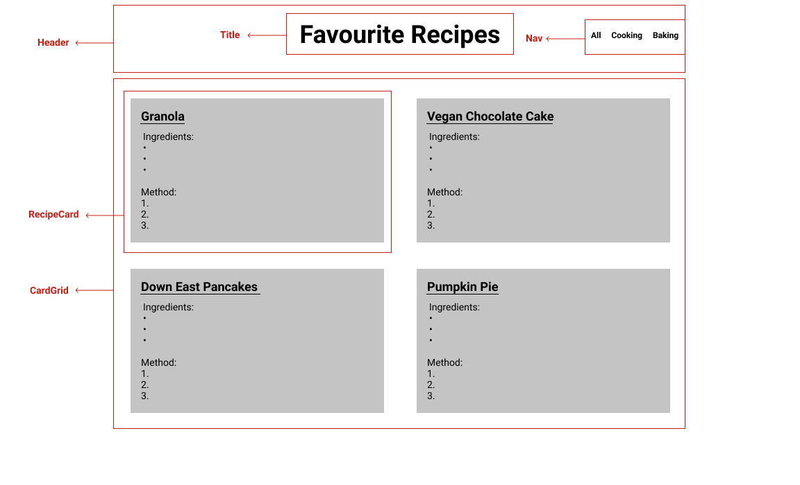

# Favourite Recipes

A front end client that displays a database of recipes.

View live application [here](https://favourite-recipes.vercel.app/)

## Marketing

This is a React application that will showcase my favourite recipes that I can share with friends and family.

Recipes are separated into three categories, cooking, baking and all.

This project was bootstrapped with [Create React App](https://github.com/facebook/create-react-app).

## Coming Soon

The following features will be released in the future:

• Collapsible recipes

• Search bar so user can try to find a specific recipe

• Form for user to add recipes

• More recipes!

## Wireframing

This is where I started with the planning of this web app:

I like to begin with sketching out how I want the app to look.

Then I'll draw boxes around the components and create a simple hierarchy of all components and elements.

 

I'll use these wireframs to write notes about hierarchy, what functions I'll need to create, how to store data, etc.
